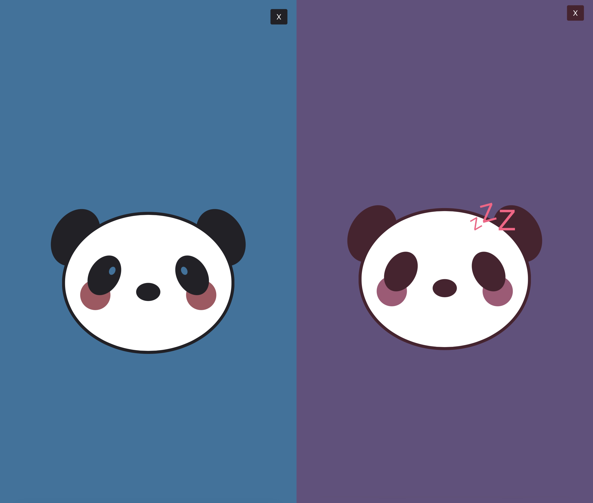

# SleePi Panda v1.0

## Description
A CircuitPython project for the Raspberry Pi Pico W (and equivalent chipsets) that keeps your computer awake and in an active state. Features a web interface with an option to toggle the application through a cute sleepy panda.

## Table of Contents
- [Installation](#installation)
- [Usage](#usage)
- [Features](#features)
- [Contributing](#contributing)
- [License](#license)
- [Contact](#contact)

## Installation
1. Download the and install latest CircuitPython UF2 file for the Raspberry Pi Pico W from [CircuitPython.org](https://circuitpython.org/board/raspberry_pi_pico_w/).
   - Alternatively, use an environment such as [Thonny](https://thonny.org/).

2. Download and extract the latest release from the [Releases page](https://github.com/Jin-yah/SleePi-Panda/releases).

3. Edit the `secrets.py` file to include your Wi-Fi's SSID and password.

4. Copy the project files to the Pico W.

5. Reboot the Pico W. The script will run automatically.

## Usage
Upon booting for the first time, the address of the hosted web interface will be printed to the end of the `boot_out.txt` file on the CircuitPython device. This can be accessed from any Wi-Fi enabled device on the same local network.

Using the web interface, click or tap on the panda to toggle the script on or off. The panda will maintain an active state on your computer while awake, and the script will be paused while the panda sleeps. The script can also be killed by pressing the 'x' button on the page. The Pico W will need to be rebooted to restart the script in the event that it is killed.

In the event that a Wi-Fi network is not connected, a simplified version of the script will run and keep your computer in an active state until the Pico W is disconnected.

## Features
- Script that periodically sends F13 key inputs, maintaining an active state without interfering with use
- Hosts a simple web interface with options to toggle and kill the script
- A cute panda that goes to sleep and wakes up with a click!

## Contributing
Any contributions/suggestions are appreciated!

## License
This project is licensed under the MIT License - see the [LICENSE.md](LICENSE.md) file for details.

## Contact
- [Email](mailto:jinyahdev@gmail.com)
- GitHub: [Jinyah](https://github.com/Jin-yah)
- Discord: Jinyah
